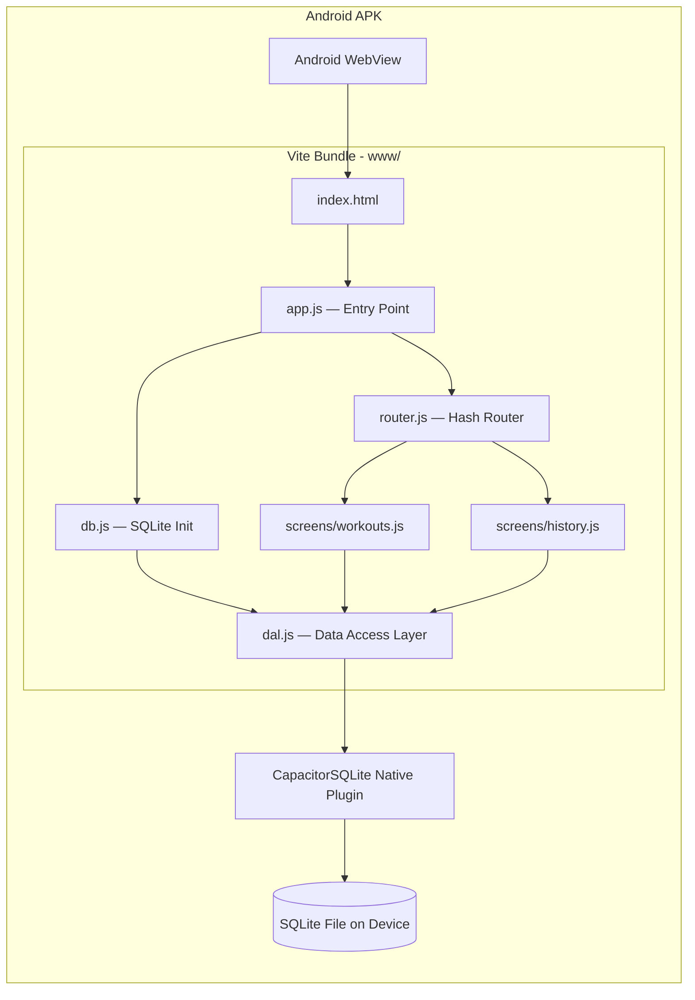

# Foundation Design

**Spec**: `.specs/features/foundation/spec.md`
**Status**: Draft

---

## Architecture Overview

The Foundation wires three independent layers: a Vite-built web bundle served inside the Capacitor Android WebView, a SQLite database managed by `@capacitor-community/sqlite`, and a minimal hash-based router that swaps screen content. All layers initialize sequentially on app start before any screen renders.



**Startup sequence:**

1. `app.js` runs → calls `db.initDatabase()`
2. `db.js` opens SQLite connection, runs schema creation (idempotent `CREATE TABLE IF NOT EXISTS`)
3. `app.js` signals router to render the current hash route
4. Router mounts the matching screen into `<main id="screen">`

---

## Code Reuse Analysis

### Existing Components to Leverage

| Component                       | Location                                       | How to Use                                                                 |
| ------------------------------- | ---------------------------------------------- | -------------------------------------------------------------------------- |
| UI prototype (HTML/Tailwind)    | `UI/code.html`                                 | Extract header, exercise card, and bottom-nav markup into screen templates |
| Tailwind config + design tokens | `UI/code.html` `<script id="tailwind-config">` | Copy verbatim into `src/index.html`                                        |
| Design system tokens            | `UI/DESIGN.md`                                 | Reference for colors, typography, spacing — already applied in prototype   |

### Integration Points

| System                        | Integration Method                                                   |
| ----------------------------- | -------------------------------------------------------------------- |
| `@capacitor-community/sqlite` | `SQLiteConnection` wrapper class + `SQLiteDBConnection` per DB       |
| Capacitor Android WebView     | `src/` → Vite builds to `www/` → `npx cap sync` copies to `android/` |

---

## Why Vite

The `@capacitor-community/sqlite` plugin exports ES modules from `node_modules`. Without a bundler, browser HTML cannot `import` from `node_modules`. Vite is the lightest option — zero-config for plain HTML/JS, no framework required, sub-second builds. Tailwind CDN continues to work inside Vite during development.

---

## Project Structure

```
PowerUp/
├── capacitor.config.json       # Capacitor config (webDir: "www")
├── package.json
├── vite.config.js              # Minimal Vite config
├── src/
│   ├── index.html              # App shell + Tailwind CDN + bottom nav
│   └── js/
│       ├── app.js              # Entry: init DB → init router
│       ├── db.js               # SQLite connection + schema
│       ├── dal.js              # All CRUD functions
│       ├── router.js           # Hash-based screen router
│       └── screens/
│           ├── workouts.js     # Workouts list screen (placeholder)
│           └── history.js      # History screen (placeholder)
├── www/                        # Vite build output (gitignored, Capacitor reads this)
└── android/                    # Generated by `npx cap add android`
```

---

## Components

### `app.js` — Entry Point

- **Purpose**: Bootstraps the app — initializes DB then hands off to the router.
- **Location**: `src/js/app.js`
- **Interfaces**:
  - `init(): Promise<void>` — called on `DOMContentLoaded`; runs `db.initDatabase()` then `router.start()`
- **Dependencies**: `db.js`, `router.js`
- **Reuses**: Nothing — thin orchestrator

---

### `db.js` — Database Initialization

- **Purpose**: Opens the SQLite connection, creates all tables on first run, exposes the live `db` connection for the DAL.
- **Location**: `src/js/db.js`
- **Interfaces**:
  - `initDatabase(): Promise<void>` — idempotent; safe to call on every launch
  - `getDB(): SQLiteDBConnection` — returns open connection; throws if called before `initDatabase()`
- **Dependencies**: `@capacitor-community/sqlite`
- **Reuses**: Nothing
- **Key implementation pattern**:

```js
import { CapacitorSQLite, SQLiteConnection } from "@capacitor-community/sqlite";

const sqlite = new SQLiteConnection(CapacitorSQLite);
let db = null;
const DB_NAME = "powerup";
const DB_VERSION = 1;

export async function initDatabase() {
  const upgrades = [{ toVersion: 1, statements: [SCHEMA_SQL] }];
  await sqlite.addUpgradeStatement(DB_NAME, upgrades);

  const isConn = (await sqlite.isConnection(DB_NAME, false)).result;
  db = isConn
    ? await sqlite.retrieveConnection(DB_NAME, false)
    : await sqlite.createConnection(
        DB_NAME,
        false,
        "no-encryption",
        DB_VERSION,
        false,
      );

  await db.open();
}

export function getDB() {
  if (!db) throw new Error("DB not initialized");
  return db;
}
```

---

### `dal.js` — Data Access Layer

- **Purpose**: Single module containing all SQL queries. Screens never write raw SQL.
- **Location**: `src/js/dal.js`
- **Interfaces** (all return Promises):

| Function              | Signature                                             | SQL operation                                    |
| --------------------- | ----------------------------------------------------- | ------------------------------------------------ |
| `getWorkouts`         | `() → Workout[]`                                      | SELECT all workouts                              |
| `createWorkout`       | `(name: string) → Workout`                            | INSERT workout                                   |
| `deleteWorkout`       | `(id: number) → void`                                 | DELETE workout (cascades to exercises, sessions) |
| `getExercises`        | `(workoutId: number) → Exercise[]`                    | SELECT exercises by workout                      |
| `addExercise`         | `(workoutId: number, name: string) → Exercise`        | INSERT exercise                                  |
| `removeExercise`      | `(id: number) → void`                                 | DELETE exercise                                  |
| `createSession`       | `(workoutId: number) → Session`                       | INSERT session                                   |
| `finishSession`       | `(sessionId: number) → void`                          | UPDATE finished_at                               |
| `getSessionExercises` | `(sessionId: number) → SessionExercise[]`             | SELECT + JOIN exercises                          |
| `logWeight`           | `(sessionId, exerciseId, weightKg) → SessionExercise` | INSERT session_exercise                          |
| `markExerciseDone`    | `(sessionExerciseId: number) → void`                  | UPDATE completed = 1                             |
| `getWeightHistory`    | `(exerciseId: number, limit: number) → WeightLog[]`   | SELECT last N weights                            |
| `getSessions`         | `(workoutId: number) → Session[]`                     | SELECT sessions by workout                       |

- **Dependencies**: `db.js` (`getDB()`)
- **Reuses**: Nothing
- **Key pattern**:

```js
import { getDB } from "./db.js";

export async function getWorkouts() {
  const db = getDB();
  const result = await db.query(
    "SELECT * FROM workouts ORDER BY created_at DESC",
  );
  return result.values ?? [];
}

export async function createWorkout(name) {
  const db = getDB();
  const result = await db.run("INSERT INTO workouts (name) VALUES (?)", [name]);
  return { id: result.changes.lastId, name };
}
```

---

### `router.js` — Hash Router

- **Purpose**: Listens to `hashchange` and `load` events; mounts the matching screen module into `<main id="screen">`.
- **Location**: `src/js/router.js`
- **Interfaces**:
  - `start(): void` — registers event listeners, renders initial route
  - `navigate(hash: string): void` — programmatic navigation (e.g. `navigate('#/workout/3')`)
- **Dependencies**: screen modules (`workouts.js`, `history.js`)
- **Reuses**: Nothing
- **Routes**:

| Hash         | Screen        |
| ------------ | ------------- |
| `#/` or `''` | Workouts list |
| `#/history`  | History       |

---

### `screens/workouts.js` — Workouts Screen

- **Purpose**: Renders the workouts list placeholder. Will be filled in M2.
- **Location**: `src/js/screens/workouts.js`
- **Interfaces**:
  - `render(container: HTMLElement): void` — inserts screen HTML into container
- **Dependencies**: None (M1 is placeholder only)

---

### `screens/history.js` — History Screen

- **Purpose**: Renders the history screen placeholder. Will be filled in M4.
- **Location**: `src/js/screens/history.js`
- **Interfaces**:
  - `render(container: HTMLElement): void` — inserts screen HTML into container
- **Dependencies**: None (M1 is placeholder only)

---

### `src/index.html` — App Shell

- **Purpose**: Static HTML shell with the header, `<main id="screen">` mount point, and bottom navigation. Screen content is injected into `<main>` by the router.
- **Location**: `src/index.html`
- **Reuses**: Header and bottom-nav markup from `UI/code.html`; Tailwind config `<script>` block verbatim

---

## Data Models

### DB Schema (SQLite — confirmed in spec)

```sql
CREATE TABLE IF NOT EXISTS workouts (
  id         INTEGER PRIMARY KEY AUTOINCREMENT,
  name       TEXT    NOT NULL,
  created_at TEXT    NOT NULL DEFAULT (datetime('now'))
);

CREATE TABLE IF NOT EXISTS exercises (
  id         INTEGER PRIMARY KEY AUTOINCREMENT,
  workout_id INTEGER NOT NULL REFERENCES workouts(id) ON DELETE CASCADE,
  name       TEXT    NOT NULL,
  sort_order INTEGER NOT NULL DEFAULT 0
);

CREATE TABLE IF NOT EXISTS sessions (
  id          INTEGER PRIMARY KEY AUTOINCREMENT,
  workout_id  INTEGER NOT NULL REFERENCES workouts(id) ON DELETE CASCADE,
  started_at  TEXT    NOT NULL DEFAULT (datetime('now')),
  finished_at TEXT
);

CREATE TABLE IF NOT EXISTS session_exercises (
  id          INTEGER PRIMARY KEY AUTOINCREMENT,
  session_id  INTEGER NOT NULL REFERENCES sessions(id) ON DELETE CASCADE,
  exercise_id INTEGER NOT NULL REFERENCES exercises(id) ON DELETE CASCADE,
  weight_kg   REAL,
  completed   INTEGER NOT NULL DEFAULT 0,
  logged_at   TEXT    NOT NULL DEFAULT (datetime('now'))
);
```

### JS Object Shapes

```js
// Workout
{ id: number, name: string, created_at: string }

// Exercise
{ id: number, workout_id: number, name: string, sort_order: number }

// Session
{ id: number, workout_id: number, started_at: string, finished_at: string | null }

// SessionExercise
{ id: number, session_id: number, exercise_id: number,
  weight_kg: number | null, completed: 0 | 1, logged_at: string }
```

---

## Error Handling Strategy

| Error Scenario                                        | Handling                                                             | User Impact                                              |
| ----------------------------------------------------- | -------------------------------------------------------------------- | -------------------------------------------------------- |
| `initDatabase()` fails (storage full, plugin missing) | `app.js` catches and renders an error banner in `<main>`             | User sees a readable error instead of blank screen       |
| DAL query fails                                       | DAL rejects promise; caller screen logs error and shows inline toast | Current screen stays visible; action fails with feedback |
| `getDB()` called before init                          | Throws synchronously with clear message                              | Caught by caller; dev-time safeguard only                |
| Android back button on root screen                    | Handled by Capacitor's default Android back behavior — exits app     | App closes cleanly (no crash)                            |

---

## Tech Decisions

| Decision           | Choice                                           | Rationale                                                                                                             |
| ------------------ | ------------------------------------------------ | --------------------------------------------------------------------------------------------------------------------- |
| Bundler            | Vite (minimal config)                            | `@capacitor-community/sqlite` requires ES module imports from `node_modules`; Vite is zero-config for vanilla HTML/JS |
| SQLite version     | `@capacitor-community/sqlite` v8.1.0             | Latest stable; Capacitor 8 support; Android-only path well documented                                                 |
| DB name            | `powerup`                                        | Single DB; all tables co-located                                                                                      |
| Migration strategy | `addUpgradeStatement` with version integer       | Plugin-native versioning; supports future schema changes without data loss                                            |
| Routing            | Hash-based (`#/route`)                           | No server needed; works in Capacitor WebView without history API config                                               |
| Tailwind           | CDN in development, same CDN in production build | Avoids PostCSS setup complexity; app is offline-only so CDN is acceptable for APK (assets bundled by Capacitor)       |

---

## Requirement Coverage

| Requirement ID | Component                                                                   |
| -------------- | --------------------------------------------------------------------------- |
| FOUND-01       | Capacitor + Vite project scaffold                                           |
| FOUND-02       | `npx cap sync` copies `www/` to `android/`                                  |
| FOUND-03       | `db.js` → `initDatabase()` + `addUpgradeStatement`                          |
| FOUND-04       | `CREATE TABLE IF NOT EXISTS` + version check = idempotent                   |
| FOUND-05       | `addUpgradeStatement` with `toVersion` integer                              |
| FOUND-06       | `router.js` default route = `#/` = workouts screen                          |
| FOUND-07       | Bottom nav in `index.html` + `router.navigate()`                            |
| FOUND-08       | Active tab class toggled by router on navigation                            |
| FOUND-09       | Capacitor default Android back behavior                                     |
| FOUND-10       | `dal.js` is the only place with SQL; screens import from it                 |
| FOUND-11       | 13 DAL functions listed in component spec above                             |
| FOUND-12       | DAL calls `getDB()` which throws if called before `initDatabase()` resolves |
