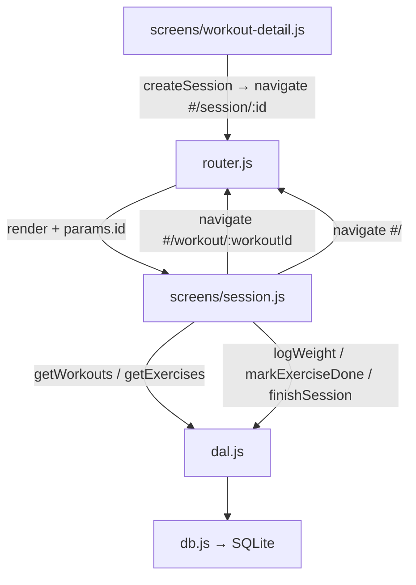

# Session Execution Design

**Spec**: `.specs/features/session-execution/spec.md`
**Status**: Draft

---

## Architecture Overview

M3 adds one new screen (`session.js`) and one new route (`#/session/:id`). The workout detail screen gains a "Iniciar Treino" button. All session data goes through the existing DAL — no schema or DAL changes needed.



**Session flow:**

1. workout-detail shows "Iniciar Treino" → `createSession(workoutId)` → `navigate('#/session/' + session.id)`
2. session.js loads: fetches workout name + exercises list; renders rows with weight input + done toggle
3. User toggles done per exercise → `logWeight` + `markExerciseDone` → row dims
4. "Finalizar Treino" enabled when ≥1 done → `finishSession(sessionId)` → `navigate('#/')`
5. Back button → `navigate('#/workout/' + workoutId)`

---

## Code Reuse Analysis

### Existing Components to Leverage

| Component                    | Location                           | How to Use                                                                    |
| ---------------------------- | ---------------------------------- | ----------------------------------------------------------------------------- |
| `createSession`              | `src/js/dal.js`                    | Called from workout-detail on "Iniciar Treino" tap                            |
| `getExercises`               | `src/js/dal.js`                    | Fetch exercise list for session screen                                        |
| `getWorkouts`                | `src/js/dal.js`                    | Fetch workout name for session screen heading                                 |
| `logWeight`                  | `src/js/dal.js`                    | Called on done toggle with weight input value                                 |
| `markExerciseDone`           | `src/js/dal.js`                    | Called after logWeight resolves                                               |
| `finishSession`              | `src/js/dal.js`                    | Called on "Finalizar Treino"                                                  |
| `navigate`                   | `src/js/router.js`                 | Navigate between screens                                                      |
| `getRouteParams`             | `src/js/router.js`                 | Read `workoutId` stored in session screen (passed via params or stored state) |
| Exercise card style          | `src/js/screens/workout-detail.js` | Reuse card markup pattern (`bg-surface-container rounded-lg p-lg border …`)   |
| Done state style             | `UI/code.html`                     | `.exercise-done` pattern: `opacity-50`, strikethrough on name                 |
| "Start Workout" button style | `UI/code.html`                     | `bg-primary-fixed text-on-primary-fixed … rounded-full` button pattern        |

### Integration Points

| System              | Integration Method                                                                       |
| ------------------- | ---------------------------------------------------------------------------------------- |
| `router.js`         | T1 adds `#/session/:id` parameterized matching + imports `session.js` (same as T3 of M2) |
| `workout-detail.js` | T2 adds "Iniciar Treino" button + `createSession` call + navigate                        |

---

## Components

### `router.js` — Session Route Extension (T1)

- **Purpose**: Add `#/session/:id` route matching, identical pattern to `#/workout/:id` from M2.
- **Location**: `src/js/router.js`
- **Changes**:
  - Import `* as sessionScreen from './screens/session.js'`
  - In `getScreen(hash)`: add match for `/^#\/session\/(\d+)$/` → `currentParams = { id: match[1] }`, return `sessionScreen`
- **Dependencies**: `screens/session.js`

---

### `workout-detail.js` — "Iniciar Treino" button (T2)

- **Purpose**: Add a Start Workout button below the exercise list when exercises exist.
- **Location**: `src/js/screens/workout-detail.js`
- **Changes**:
  - In the rendered HTML, append a "Iniciar Treino" button after `#exercise-list` — only when `exercises.length > 0`
  - On click: call `createSession(workoutId)`, then `navigate('#/session/' + session.id)`
  - On error: render an alert (or inline error message) — do not navigate
- **Dependencies**: `createSession` from `dal.js` (already imported pattern used in file)

**Button markup:**

```html
<div class="pt-md pb-xl flex justify-center">
  <button
    id="btn-start-workout"
    class="bg-primary text-on-primary font-label-bold text-label-bold px-8 py-4 rounded-full
           flex items-center gap-sm active:scale-95 transition-transform"
  >
    <span
      class="material-symbols-outlined"
      style="font-variation-settings:'FILL' 1"
      >play_arrow</span
    >
    Iniciar Treino
  </button>
</div>
```

---

### `screens/session.js` — New Active Session Screen (T3)

- **Purpose**: Full session execution screen — shows exercises with weight inputs and done toggles, progress indicator, and finish button.
- **Location**: `src/js/screens/session.js`
- **Interface**: `render(container, params)` — `params.id` is the session ID
- **State**: Module-level `doneSet` (a `Set` of `sessionExerciseId` values) tracks done state in memory; `seMap` maps `exerciseId → sessionExerciseId` for exercises already logged.
- **Responsibilities**:
  1. Parse `params.id` as `sessionId`; load workout name + exercises via DAL
  2. Render exercise rows with weight input + done toggle
  3. Done toggle click:
     - If not done: read weight input (default `0`), call `logWeight(sessionId, exerciseId, weightKg)`, get `sessionExerciseId` from result, call `markExerciseDone(sessionExerciseId)`, add to `doneSet`, update row visual + progress
     - If already done (visual toggle off): remove from `doneSet`, restore row visual + update progress (no DB change)
  4. Progress: `X / N exercícios feitos` — updated live without full re-render
  5. "Finalizar Treino" button: disabled if `doneSet.size === 0`; on click calls `finishSession(sessionId)` then `navigate('#/')`
  6. Back button: `navigate('#/workout/' + workoutId)`
- **Dependencies**: `dal.js` (getWorkouts, getExercises, logWeight, markExerciseDone, finishSession), `router.js` (navigate)

> **workoutId tracking**: the session screen needs `workoutId` for the back button and to fetch exercises. Strategy: fetch all sessions is overkill — instead, store `workoutId` on the `data-workout-id` attribute of the container, set by workout-detail before navigating.  
> Simpler: `session.js` calls `getExercises` but needs `workoutId`. Since `getSessionExercises` joins exercises, use that after creating session rows — but for a fresh session there are no rows yet.  
> **Chosen approach**: workout-detail encodes `workoutId` in the navigation hash as a query param: `#/session/1?w=2`, and router passes it. _Too complex._  
> **Simplest**: Store `workoutId` in a module-level variable in `router.js` alongside `currentParams`, set when navigating from workout-detail. Actually even simpler: workout-detail sets `window._sessionWorkoutId = workoutId` before navigating — session.js reads it. Clean enough for v1 intra-session state.

**Revised approach — `window._sessionWorkoutId`:**

```js
// In workout-detail.js before navigate:
window._sessionWorkoutId = workoutId;
navigate("#/session/" + session.id);

// In session.js:
const workoutId = window._sessionWorkoutId;
```

---

## Exercise Row Design (Session)

```html
<div
  class="session-exercise-row bg-surface-container rounded-lg p-lg border border-outline-variant flex items-center justify-between transition-opacity"
  data-exercise-id="1"
>
  <div class="flex items-center gap-md flex-1 min-w-0">
    <button
      class="btn-done-toggle text-on-surface-variant active:scale-90 transition-transform flex-shrink-0"
      data-exercise-id="1"
    >
      <span class="done-icon material-symbols-outlined" style="font-size:28px"
        >check_circle</span
      >
    </button>
    <span
      class="exercise-name font-label-bold text-label-bold text-on-surface truncate"
      >Supino Reto</span
    >
  </div>
  <div class="flex items-center gap-sm flex-shrink-0">
    <input
      type="number"
      inputmode="decimal"
      placeholder="kg"
      class="weight-input w-16 bg-surface-container-high rounded p-sm border border-outline-variant
             text-on-surface font-body-md text-body-md text-center focus:border-primary outline-none"
      min="0"
      step="0.5"
    />
    <span class="text-on-surface-variant font-body-md text-body-md text-sm"
      >kg</span
    >
  </div>
</div>
```

**Done state applied via JS (no re-render):**

```js
row.classList.add("opacity-50");
nameEl.classList.add("line-through");
toggleBtn.querySelector(".done-icon").style.fontVariationSettings = "'FILL' 1";
toggleBtn.classList.add("text-primary");
toggleBtn.classList.remove("text-on-surface-variant");
```

---

## Data Flow

No DAL or schema changes. All functions already implemented:

| Screen Action          | DAL Call                                                          | Returns              |
| ---------------------- | ----------------------------------------------------------------- | -------------------- |
| Start session          | `createSession(workoutId)`                                        | `{ id, workout_id }` |
| Load session exercises | `getExercises(workoutId)`                                         | `Exercise[]`         |
| Load workout name      | `getWorkouts()` → filter                                          | `Workout`            |
| Mark done (first time) | `logWeight(sessionId, exerciseId, kg)` → `markExerciseDone(seId)` | `SessionExercise`    |
| Finish session         | `finishSession(sessionId)`                                        | `void`               |
