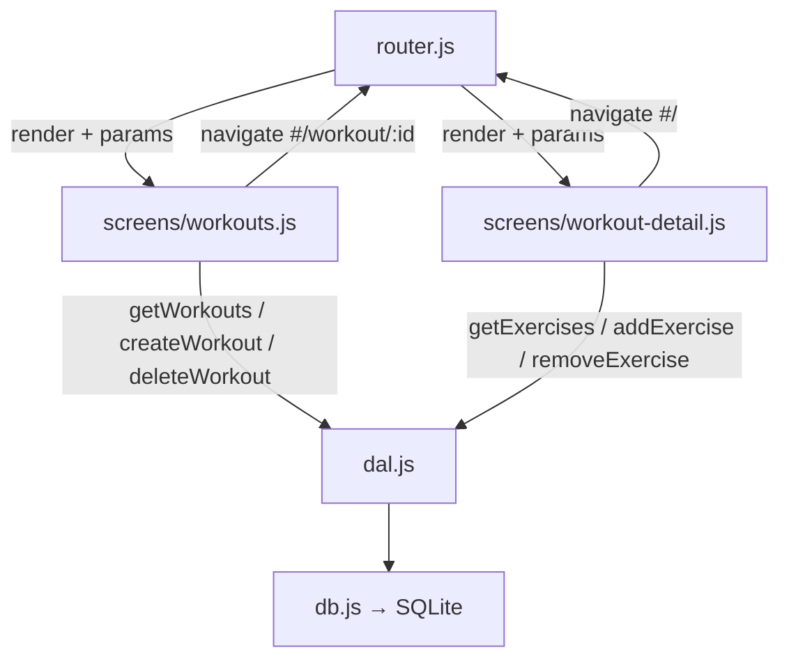

# Workout Management Design

**Spec**: `.specs/features/workout-management/spec.md`
**Status**: Draft

---

## Architecture Overview

M2 extends the existing router with parameterized route support, rewrites the `workouts.js` placeholder into a fully functional screen, and introduces a new `workout-detail.js` screen. The DAL is already complete — no changes needed there. All data flows through `dal.js`; screens never write raw SQL.



**User flow:**

1. App opens → router renders `workouts.js` → lists workouts from DB
2. User taps workout card → `navigate('#/workout/1')` → router parses params → renders `workout-detail.js` with `{ id: '1' }`
3. workout-detail fetches exercises for that workout ID
4. User taps back → `navigate('#/')` → router renders `workouts.js` again

---

## Code Reuse Analysis

### Existing Components to Leverage

| Component                | Location                     | How to Use                                                             |
| ------------------------ | ---------------------------- | ---------------------------------------------------------------------- |
| DAL — workout functions  | `src/js/dal.js`              | `getWorkouts`, `createWorkout`, `deleteWorkout` — import directly      |
| DAL — exercise functions | `src/js/dal.js`              | `getExercises`, `addExercise`, `removeExercise` — import directly      |
| `navigate(hash)`         | `src/js/router.js`           | Import to navigate between screens                                     |
| Empty state markup       | `src/js/screens/workouts.js` | Reuse the existing empty-state pattern (icon + two text lines)         |
| Card style               | `UI/code.html`               | `bg-surface-container rounded-lg p-lg border border-[#333333]` pattern |
| FAB style                | `UI/code.html`               | `fixed bottom-8 right-6 w-14 h-14 … rounded-full` pattern              |
| Tailwind design tokens   | `src/index.html`             | Already loaded globally — use existing color/font/spacing classes      |

### Integration Points

| System       | Integration Method                                                              |
| ------------ | ------------------------------------------------------------------------------- |
| `router.js`  | T1 adds parameterized matching + `getRouteParams()`; T3 registers the new route |
| `index.html` | T1 adds `id="btn-back"` to the back button for programmatic show/hide control   |
| `dal.js`     | No changes — all required functions already implemented and unit-tested         |

---

## Components

### `router.js` — Parameterized Route Extension (T1 + T3)

- **Purpose**: Extend existing hash router to parse `#/workout/:id` and expose params to screens.
- **Location**: `src/js/router.js`
- **New interfaces**:
  - `getRouteParams(): { id?: string }` — returns params extracted from the current hash
- **Changes**:
  - Add `currentParams` module-level variable (default `{}`)
  - Update internal `render()` to detect `#/workout/` prefix, extract the numeric ID, set `currentParams = { id }`, and dispatch to `workoutDetailScreen`
  - Update `screen.render(container)` call to `screen.render(container, currentParams)` for forward compatibility (existing screens ignore the second arg — JS allows extra args)
- **New route added in T3**: When `workout-detail.js` exists, T3 imports it and adds it to the route resolution logic
- **Dependencies**: `screens/workout-detail.js` (imported in T3)

**Key implementation pattern (T1):**

```js
let currentParams = {};

function getScreen(hash) {
  if (routes[hash]) {
    currentParams = {};
    return routes[hash];
  }
  const workoutMatch = hash.match(/^#\/workout\/(\d+)$/);
  if (workoutMatch) {
    currentParams = { id: workoutMatch[1] };
    return workoutDetailScreen; // added in T3
  }
  currentParams = {};
  return workoutsScreen; // fallback
}

export function getRouteParams() {
  return currentParams;
}
```

---

### `src/index.html` — Back Button ID (T1)

- **Purpose**: Add `id="btn-back"` to the existing back button so screens can show/hide/bind it.
- **Change**: Single attribute addition to existing `<button>` in `<header>`.
- **Pattern used by screens**:

```js
// In workout-detail.js — show and wire back button
const backBtn = document.getElementById("btn-back");
backBtn.classList.remove("invisible");
backBtn.onclick = () => navigate("#/");

// In workouts.js — hide back button
document.getElementById("btn-back").classList.add("invisible");
document.getElementById("btn-back").onclick = null;
```

---

### `screens/workouts.js` — Full Rewrite (T2)

- **Purpose**: Replace static placeholder with a fully functional workout management screen.
- **Location**: `src/js/screens/workouts.js`
- **Interface**: `render(container)` — same signature, no breaking change to router
- **Responsibilities**:
  1. On render: call `getWorkouts()`, build list of cards or show empty state
  2. FAB click: show inline create-form (appended to container), focus input
  3. Create form submit: validate (trim, non-empty), call `createWorkout(name)`, re-render
  4. Create form cancel: remove form, re-render (or just hide)
  5. Workout card click: call `navigate('#/workout/' + workout.id)`
  6. Delete button click: show native `confirm()` dialog, call `deleteWorkout(id)`, re-render
  7. Hide back button on render
- **Error handling**: wrap async calls in try/catch, render error message into container on failure
- **Dependencies**: `dal.js` (`getWorkouts`, `createWorkout`, `deleteWorkout`), `router.js` (`navigate`)

**Workout card markup pattern:**

```html
<div
  class="bg-surface-container rounded-lg p-lg border border-outline-variant flex items-center justify-between cursor-pointer active:bg-surface-container-high"
  data-workout-id="1"
>
  <div>
    <h3 class="font-label-bold text-label-bold text-on-surface">Treino A</h3>
  </div>
  <div class="flex items-center gap-sm">
    <button
      class="btn-delete text-on-surface-variant hover:text-error transition-colors p-sm"
      data-workout-id="1"
      aria-label="Deletar treino"
    >
      <span class="material-symbols-outlined" style="font-size:20px"
        >delete</span
      >
    </button>
    <span class="material-symbols-outlined text-on-surface-variant"
      >chevron_right</span
    >
  </div>
</div>
```

**Create form markup pattern (inline, appended below FAB area or at top of list):**

```html
<div
  id="create-workout-form"
  class="bg-surface-container-high rounded-lg p-lg border border-primary"
>
  <h3 class="font-label-bold text-label-bold text-on-surface mb-md">
    Novo Treino
  </h3>
  <input
    id="workout-name-input"
    type="text"
    placeholder="Nome do treino"
    class="w-full bg-surface-container rounded p-sm border border-outline-variant
           text-on-surface font-body-md text-body-md focus:border-primary outline-none mb-md"
  />
  <div class="flex gap-sm justify-end">
    <button
      id="btn-cancel-workout"
      class="text-on-surface-variant font-label-bold text-label-bold px-md py-sm rounded"
    >
      Cancelar
    </button>
    <button
      id="btn-save-workout"
      class="bg-primary text-on-primary font-label-bold text-label-bold px-md py-sm rounded"
    >
      Salvar
    </button>
  </div>
</div>
```

---

### `screens/workout-detail.js` — New Screen (T3)

- **Purpose**: Display and manage the exercises of a single workout.
- **Location**: `src/js/screens/workout-detail.js`
- **Interface**: `render(container, params)` — receives `params.id` from router
- **Responsibilities**:
  1. On render: read `params.id`, call `getWorkouts()` to find workout name (or store name on card in workouts.js — simpler: re-query), call `getExercises(id)`, build list or show empty state
  2. Show and bind back button: `document.getElementById('btn-back')`
  3. Add button click: show inline add-form, focus input
  4. Add form submit: validate, call `addExercise(workoutId, name)`, re-render
  5. Remove button click: `confirm()` dialog, call `removeExercise(id)`, re-render
  6. Error handling: try/catch, render error on failure
- **Dependencies**: `dal.js` (`getWorkouts`, `getExercises`, `addExercise`, `removeExercise`), `router.js` (`navigate`, `getRouteParams`)

> **Note on workout name**: `getWorkouts()` returns all workouts. Filter by `params.id` to get the name. This avoids adding a `getWorkout(id)` function to the DAL (not needed anywhere else in M2).

**Exercise row markup pattern:**

```html
<div
  class="bg-surface-container rounded-lg p-lg border border-outline-variant flex items-center justify-between"
>
  <div class="flex items-center gap-md">
    <div
      class="w-10 h-10 rounded-full bg-surface-container-high flex items-center justify-center"
    >
      <span
        class="material-symbols-outlined text-on-surface-variant"
        style="font-size:18px"
        >fitness_center</span
      >
    </div>
    <span class="font-label-bold text-label-bold text-on-surface"
      >Supino Reto</span
    >
  </div>
  <button
    class="btn-remove-exercise text-on-surface-variant hover:text-error transition-colors p-sm"
    data-exercise-id="1"
    aria-label="Remover exercício"
  >
    <span class="material-symbols-outlined" style="font-size:20px"
      >remove_circle</span
    >
  </button>
</div>
```

---

## Data Flow

No schema or DAL changes. All required functions are implemented:

| Screen Action     | DAL Call                       | Returns      |
| ----------------- | ------------------------------ | ------------ |
| Load workouts     | `getWorkouts()`                | `Workout[]`  |
| Create workout    | `createWorkout(name)`          | `Workout`    |
| Delete workout    | `deleteWorkout(id)`            | `void`       |
| Load workout name | `getWorkouts()` → filter by id | `Workout`    |
| Load exercises    | `getExercises(workoutId)`      | `Exercise[]` |
| Add exercise      | `addExercise(workoutId, name)` | `Exercise`   |
| Remove exercise   | `removeExercise(id)`           | `void`       |

---

## UI/UX Decisions

| Decision                       | Choice                                                              | Reason                                                 |
| ------------------------------ | ------------------------------------------------------------------- | ------------------------------------------------------ |
| Create/Add form placement      | Inline card appended at top of list, above existing items           | No modal library dependency; consistent with app style |
| Delete/Remove confirmation     | Native `window.confirm()` dialog                                    | Zero dependencies, works in WebView, sufficient UX     |
| Workout card tap target        | Full card is clickable; delete button stops propagation             | Clear affordance, standard mobile pattern              |
| Back button control            | Screens manage `btn-back` visibility and `onclick` handler directly | Simplest approach; no extra state management needed    |
| Workout name for detail screen | Fetched via `getWorkouts()` + filter (no new DAL function)          | Reuses existing DAL; avoids adding `getWorkout(id)`    |
